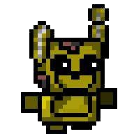

# 😎 Arthur-Fran-a
🫡 Estou atualmente no segundo ano, aprendendo a programar e querendo me profinalizar na área de Engenharia de Software para focar em games. Estudando no sistema Firjan Senai e Sesi, cursanso TI.

 

😉 Ainda sou um artista, crio design de interfaces, personagens, cenáros, e caracterizar qualquer coisa. 

